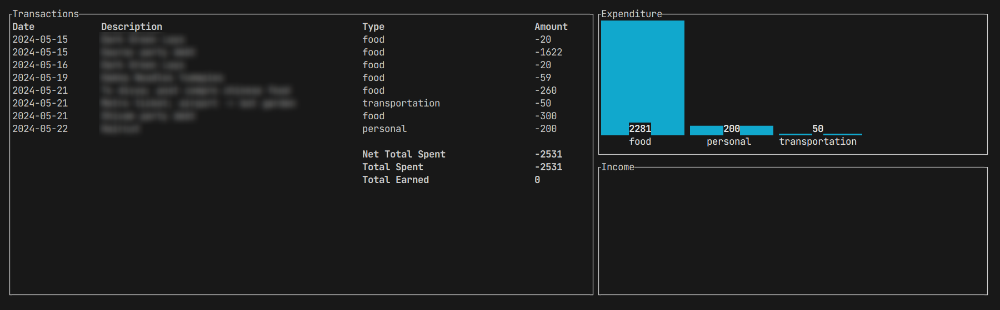

# Budget Tracker

## Description
A minimal TUI based budget tracker

## Usage
- To see graphical data
```bash
budget-tracker
```

- To add a new entry (add `-` infront of amount if you received money)
```bash
budget-tracker -a
```

## Screenshot
